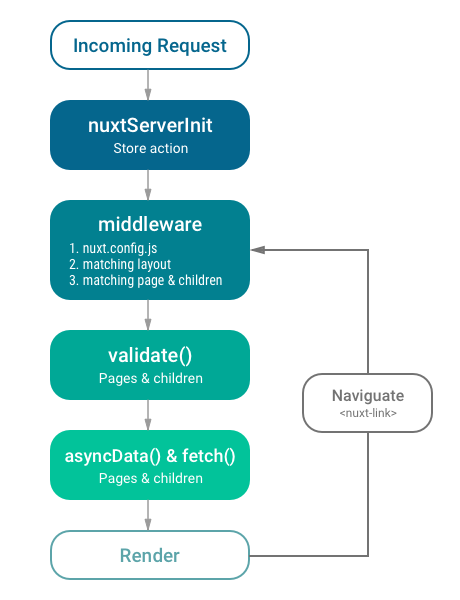

## Team Deep Dive
---
**Content to Cover**
1. Basic JavaScript
2. Nuxt.js [Docs](https://nuxtjs.org/)
3. Vue.js - [Docs](https://vuejs.org/v2/guide/instance.html#Instance-Lifecycle-Hooks)
4. Vuetify.js - [Docs](https://vuetifyjs.com/en/components/api-explorer)

### JavaScript
- **Promises**: this javascript feature is really important in this type of project because we can asynchronously fetch data
  - This allows other functions to run while API requests are being made to fetch pieces of data
  - So in the example below, the request is made and a promise is made, the `.then()` and `.catch()` statements are two ways to *resolve* a promise.
  - Here is an example of a promise with a HTTP request:
```javascript
import axios from 'axios' # Axios is a JS package to make HTTP requests

# inside a component components/table.vue
export default { 
  data: () => ({
    data: []
  }),
  methods: {
    async fetchTheData() { # right here we define the "async" part
      res_data = []
      await axios.get("http://localhost:8000/fake/api/data") # here we call the "await" part
        .then(res => {
          if (res.status === 200) {
            res_data = res.data
          }
        })
        .catch(err => {
          console.log(err)
        })
    }
  }
}
```

- We shouldn't really get into too complex of javascript, but if we having to do any data manipulation, one package I love is [Lodash](https://lodash.com/). It provides a lot of resources for manipulating all kinds of data
- Things to remember in JS:
  - You dont have to declare variable types, similar to python, so you can just do: `arr_var = [1, 2, 3]` or `string_var = "Hello, World!"` and it will auto declare the type
  - The difference between `==` and `===` in javascript
    - `==` : matches on same value, converts variable types to the same type before comparison
      - So `1 == "1"` would be true
    - `===` : matches on same value **and** type
      - But `1 === "1"` would not be true
    - In general you would use `===` because you typically dont want to convert the types, and if you did you would do it manually
  - 

### Nuxt.js & Vue.js
Below is the schema that nuxt follows when a request to the page is made


#### What we will use in our program
- **asyncData**: this Nuxt.js feature allows you to fetch data before a page is rendered to the user on the server side, so we can make an API request to get the product data before the page is loaded.
  - This allows us to only display a page hydrated with data already, so that users dont see empty tables or what not
- **Vuex**: vuex gives **state management** to your application, which serves as a central location to store and mutate data for every component in the application
  - **state**: the data storage of vuex, it is a data object
    ```javascript
    state = {
      value_one: "Hello",
      value_two: "World"
    }
    ```
  - **mutations**: this is the **only** way to change the data in the state, you *commit* these
  - **actions**: these commit mutations, so typically they fetch the data to pass to a mutation
  - **getters**: these are used to fetch data from the state, they can contain any data mutation you want to process before handing it to a component
  - **Vuex store example**:
```javascript
const store = new Vuex.Store({
  state: {
    value: 0
  },
  mutations: {
    increment(state) {
      state.value++
    }
  },
  actions: {
    increment({commit}) {
      commit('increment')
    }
  }
})
```
- **Lifecycle Hooks**: these can be used inside components to call certain functions based on the lifecycle of a component

- **Directives**: special form of HTML attributes that can act as javascript expressions
```html
<p v-if="true">You can see this text</p>
<p v-else>You cannot see this text</p>
<v-btn v-on:click="callThisFunction()">Click Me</v-btn>
```
- **HTML Interpolation**: this allows you to bind data directly into your html content
```javascript
<template>
  <p>My name is {{name}}</p>
</template>

<script>
export default {
  data: () => ({
    name: "Cole Tucker"
  })
}
</script>
```
- 


### Vuetify.js